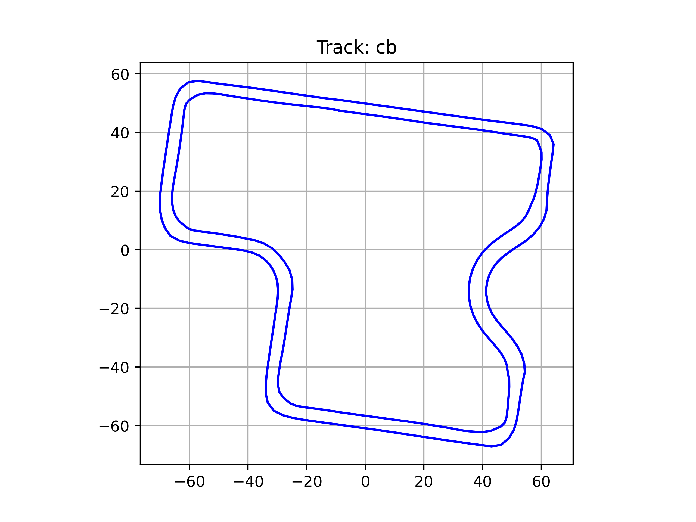
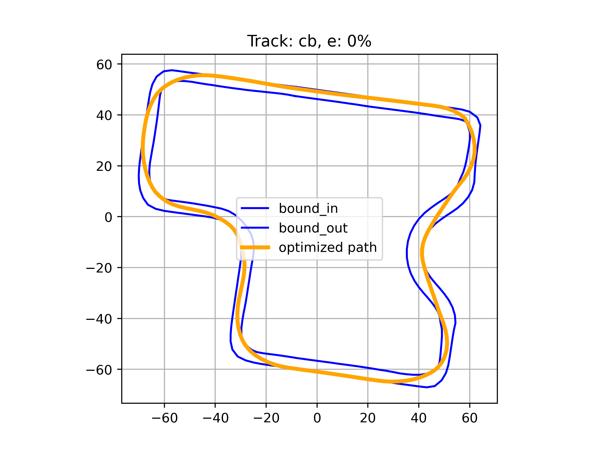
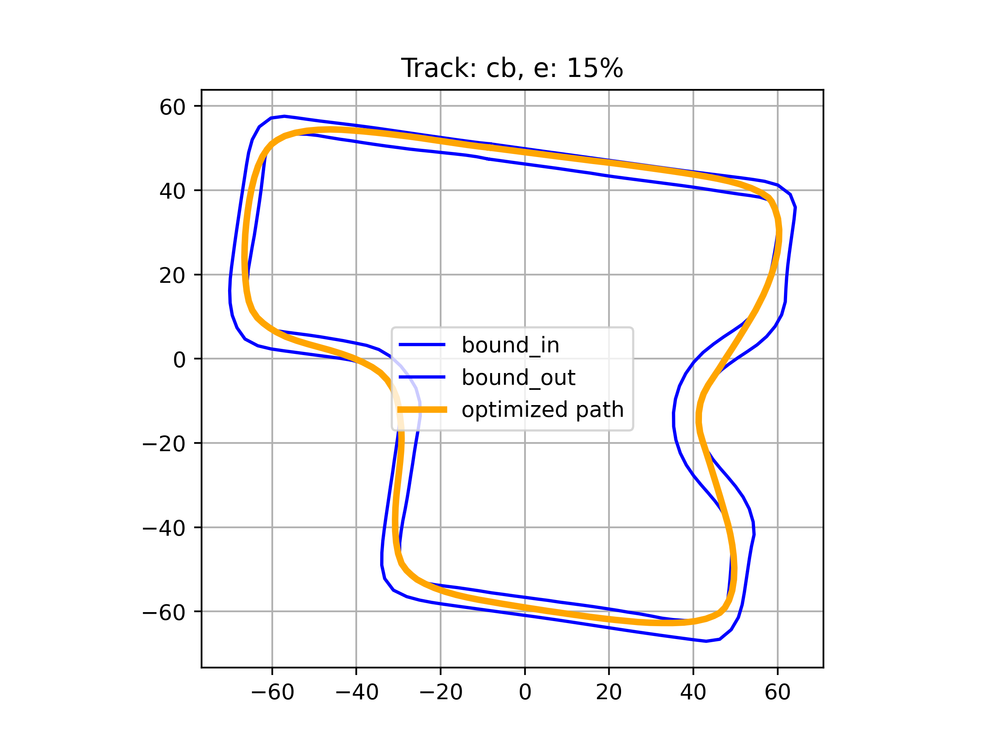
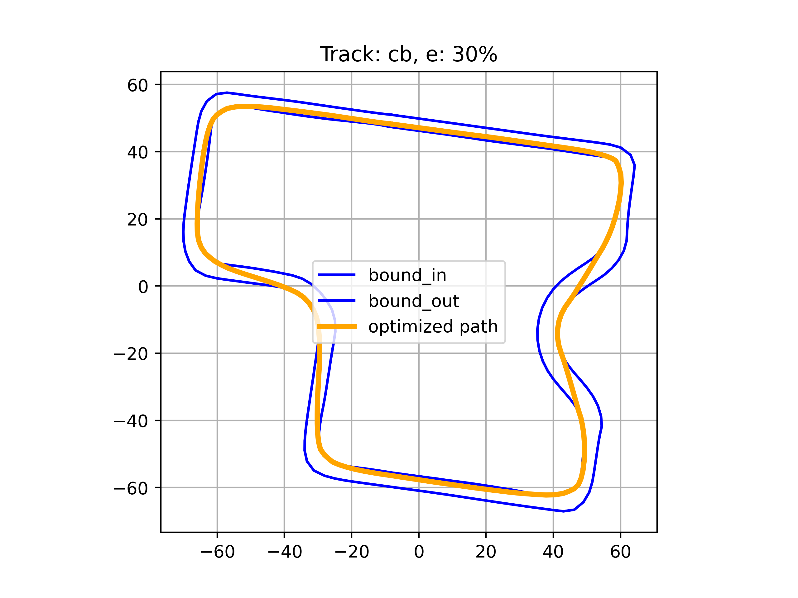
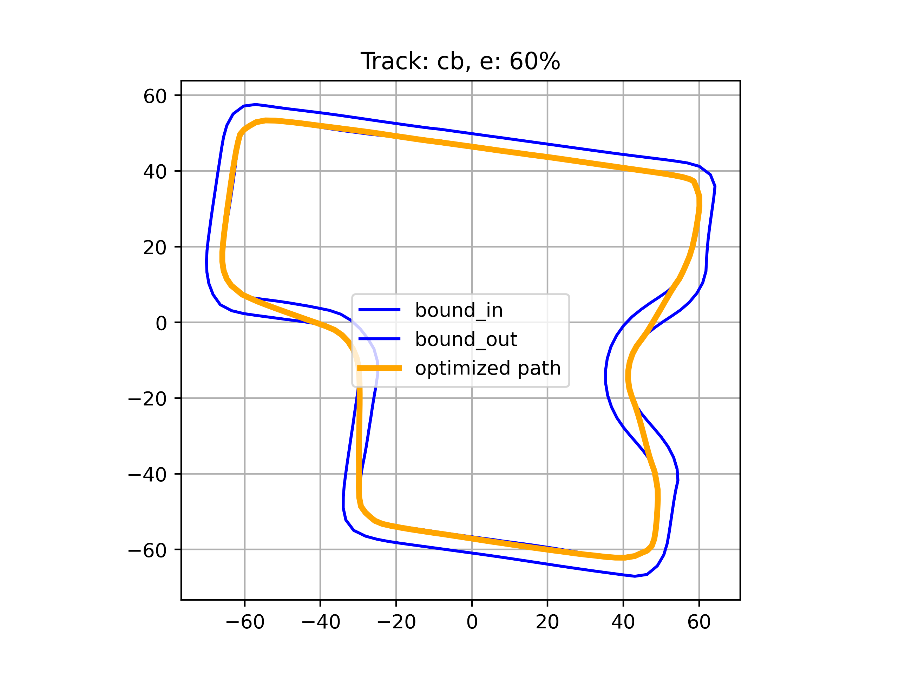
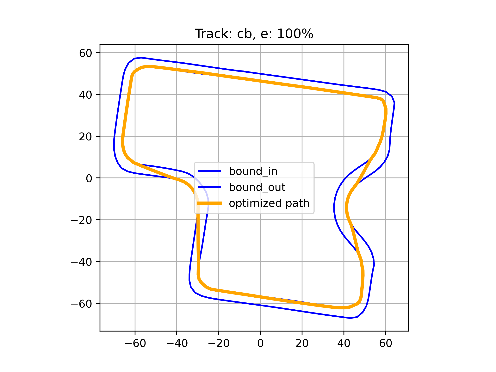

# race-driver-model
A module that creates a optimized global path for racing competition.

-  This is the module used in the competition. ["Autonomous Robot Racing Competitions"](https://ieeexplore.ieee.org/abstract/document/10474524)

-  It was created with reference to the paper. ["Race driver model"](https://www.sciencedirect.com/science/article/pii/S0045794908000163)

-  This code was written based on python 3.8.

### Input

 - GPS longitude, latitude point set as csv fils.
 - You can check the example files at [/path/gps/](./path/gps/)
 
### Results

|  |  |  |
|-------------------------|-------------------------|-------------------------|
| 
Path creation bounds
 | 
epsilon = 0% __(Minimum curvature path)__
 | 
epsilon = 15%
 |
|  |  |  |
| 
epsilon = 30%
 | 
epsilon = 60%
 | 
epsilon = 100% __(Shortest Path)__
 |

 - Minimum curvature path if epsilon is close to 0%
 - Shortest path if epsilon is close to 100%
